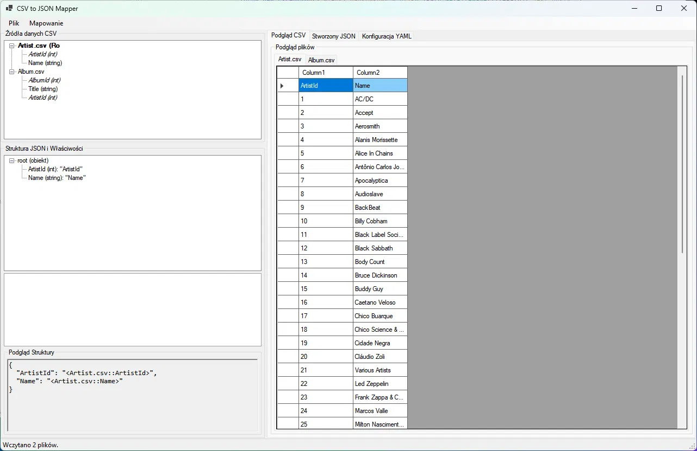
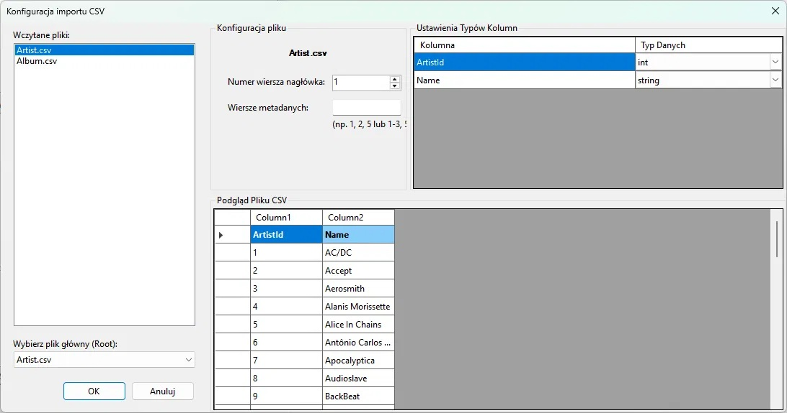
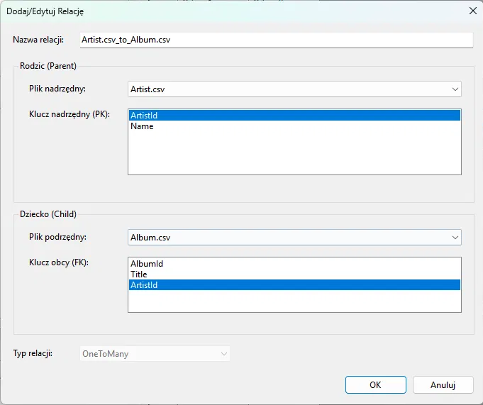
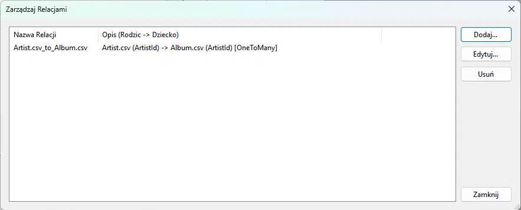
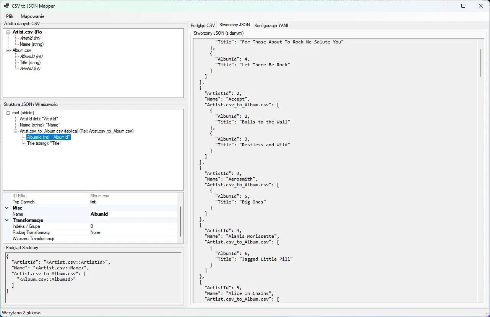
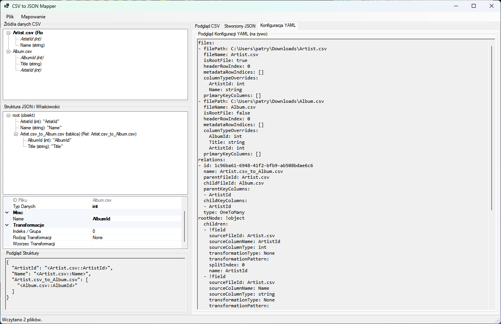

# CSV to JSON Mapper

A Windows desktop tool that converts flat CSV files into structured, nested JSON documents.


Instead of writing a one-off script for every conversion, you define the mapping once in a visual editor and reuse it whenever the same data arrives again.



## Table of Contents

- [Features](#features)
- [How It Works](#how-it-works)
- [Tech Stack](#tech-stack)
- [Project Structure](#project-structure)
- [Building](#building)

## Features

| Feature | Description |
| :--- | :--- |
| **Custom schema mapping** | Map CSV columns to JSON fields, including nested objects and arrays, using a tree of mapping elements |
| **Multiple input files** | Combine data from several related CSV files by defining relations between them, similar to joins between tables |
| **Value transformations** | Adjust values on the way from CSV to JSON: formatting, type handling and sorting of output collections |
| **Reusable configurations** | Save a whole mapping project to a YAML file and import it later |
| **JSON export** | Generate and save the resulting JSON documents to disk |

## How It Works
 
The example below converts two related files, `Artist.csv` and `Album.csv`, into a single JSON document where every artist contains an array of their albums.
 
### 1. Load the data
 
Select the CSV files, mark one of them as the root, point out the header row and assign a data type to every column. The preview shows the parsed content before anything is imported.
 

 
### 2. Design the output structure
 
The left panel lists the available columns from every loaded file. Build the target document in the structure tree by adding objects, arrays and fields, then point each field at a source column. The bottom panel shows a live template of the document being built.
 

 
### 3. Link the files
 
When data spans multiple files, define a relation: pick the parent file with its primary key, the child file with its foreign key, and the relation type.
 

 
All defined relations are listed in one place and can be edited or removed.
 

 
### 4. Generate the output
 
`JsonGenerationService` walks the mapping tree, resolves the relations and applies the transformations. Related rows are nested as arrays inside their parent object, so each artist carries their own list of albums.
 

 
### 5. Save the project
 
The whole mapping can be exported to a YAML file and imported later, so recurring conversions take seconds.


## Tech Stack

| Layer | Technology |
| :--- | :--- |
| Language | C# / .NET |
| UI | Windows Forms |
| Configuration | YAML |

## Project Structure

```
CsvJsonMapper/
├── Forms/       # main window, dialogs, YAML import
├── Models/
│   ├── Mapping/       # MappingObject, MappingArray, MappingField, Relation
│   └── Configuration/ # ProjectConfiguration
└── Services/
    ├── CsvParsingService.cs
    ├── JsonGenerationService.cs
    ├── JsonExportService.cs
    ├── YamlConfigurationService.cs
    └── TransformationHelper.cs
```

## Building

**Requirements:** .NET 8 SDK, Windows

Clone the repository and run:
```bash
dotnet build CsvJsonMapper.sln
dotnet run --project CsvJsonMapper/CsvJsonMapper.csproj
```
Or open `CsvJsonMapper.sln` in Visual Studio / Rider and press Run.
